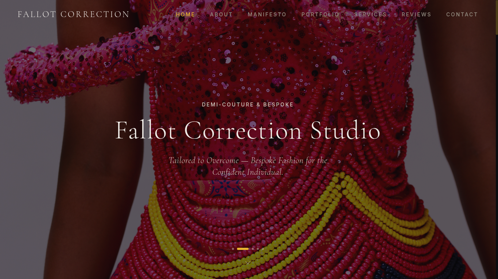
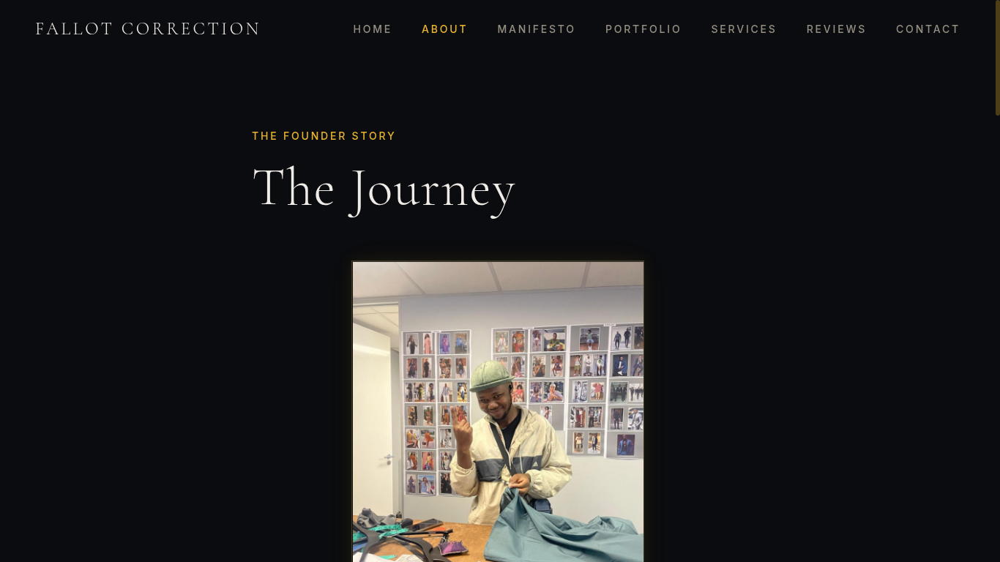
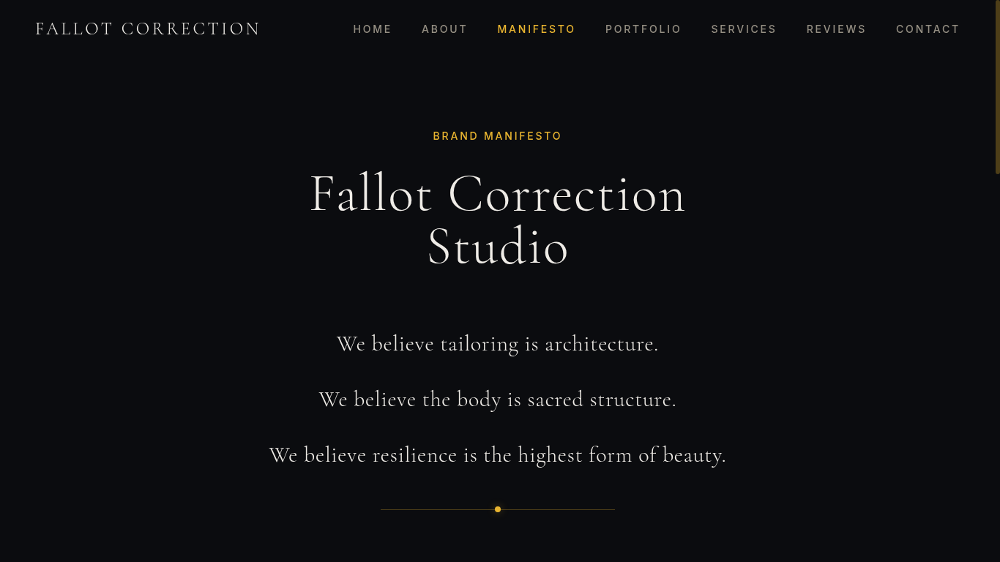
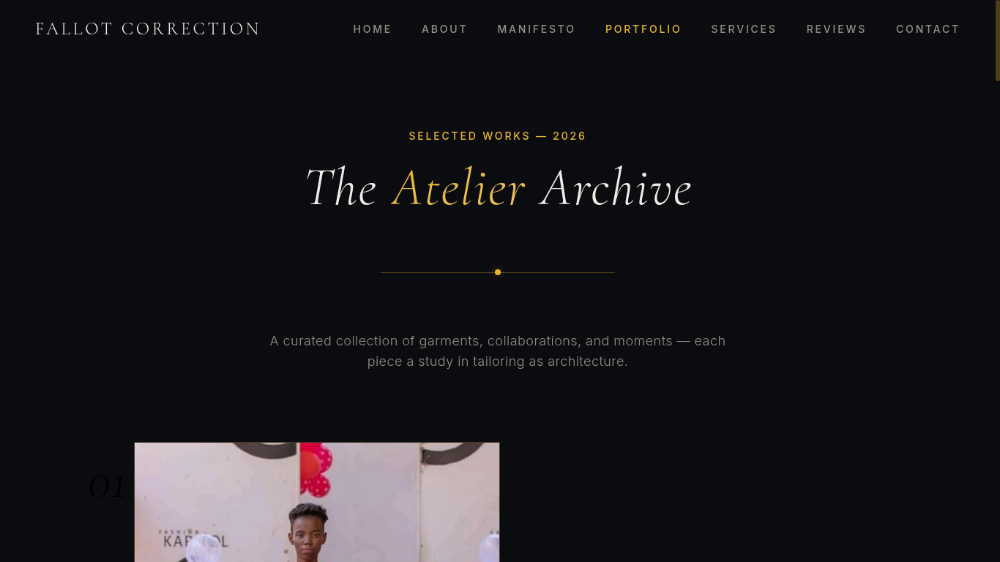
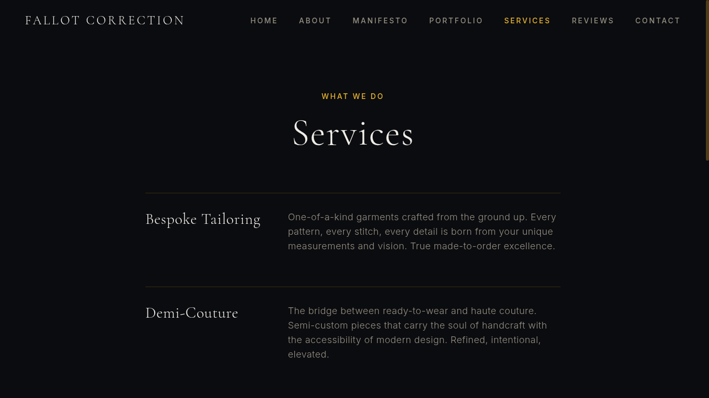
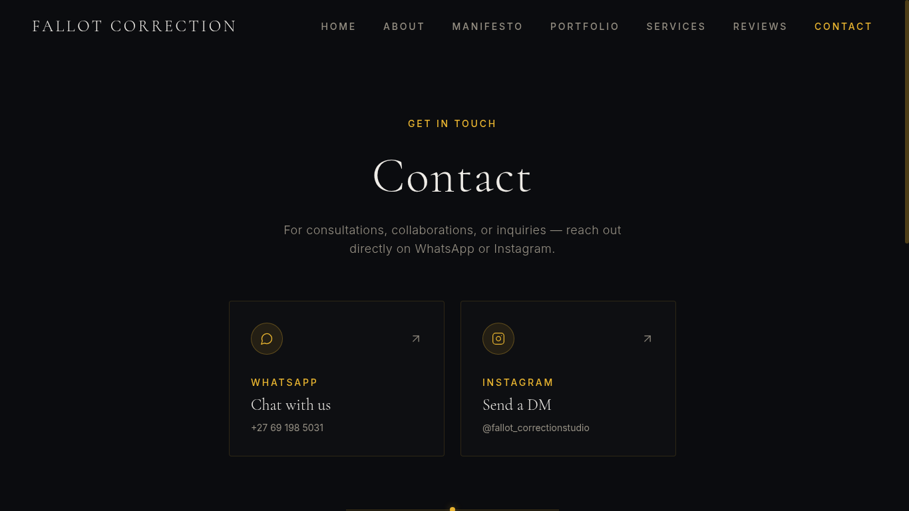

# Fallot Correction Studio

A digital atelier for a luxury demi-couture and bespoke fashion house — built with React, TypeScript, Tailwind CSS, and a cinematic dark-and-gold editorial aesthetic.

## Preview

### Home

### About

### Manifesto

### Portfolio

### Services

### Contact

## Project info

**URL**: https://fallotcorrectionstudio.netlify.app

